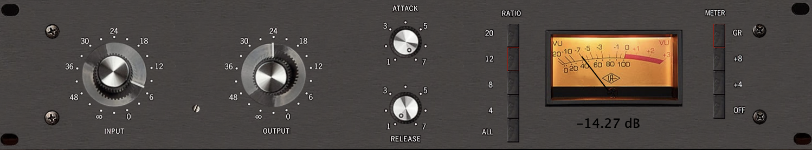

## miniRT

- A classic 1176-style compressor written in C++ with the JUCE framework

### How to use
- Just copy the plugin (VST3 or Audio Unit) from the `components` folder to the plugin folder on your computer.
